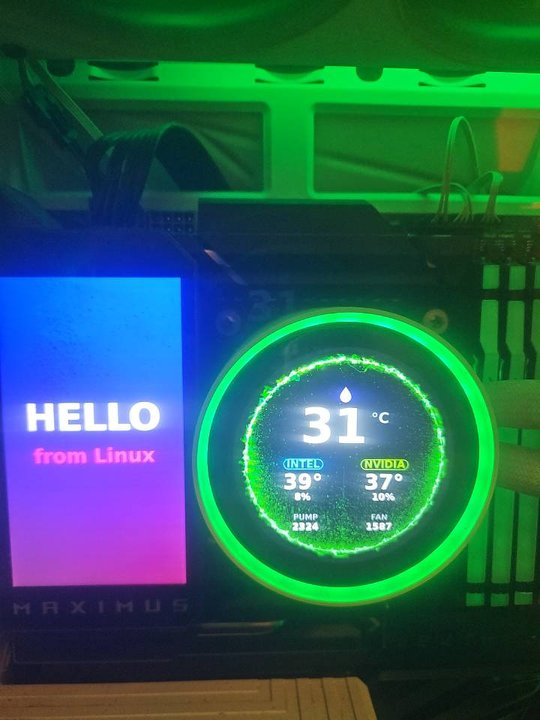
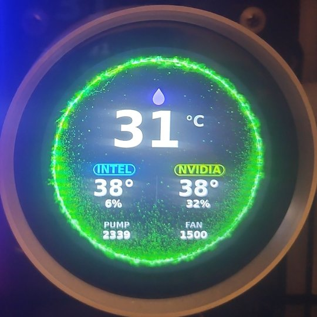
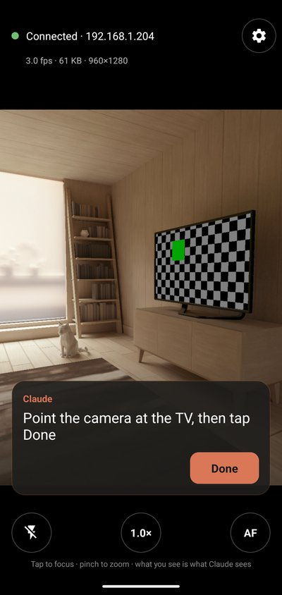
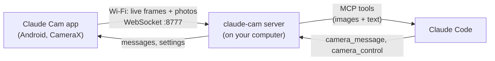

# Claude Cam

**Let Claude see through your phone's camera.** Point your phone at the thing you're working on, like
a circuit board, a little screen, a 3D printer or a TV, and Claude can look at it while it works,
instead of asking you to describe what you see.

> Unofficial community project. Not made by or affiliated with Anthropic.

<table>
  <tr>
    <td width="50%"></td>
    <td width="50%"></td>
  </tr>
  <tr>
    <td>What Claude sees through the phone.</td>
    <td>Claude zooms in on the cooler screen and reads it: 31 °C, pump 2339 rpm, fan 1500 rpm. Those numbers matched the PC's own sensors exactly.</td>
  </tr>
</table>

## What it's good for

- **Hardware and electronics.** Claude flashes your ESP32 or Arduino, then checks the LED or display itself.
- **Screens Claude can't read from software.** A TV, a kiosk, a printer panel, an e-ink display, another phone.
- **Long-running things.** Claude watches a boot sequence or a print and reacts when something changes.
- **Things too fast to see.** Claude records high-speed clips (up to 240 fps on phones that allow it) and
  measures every frame. It can tell you the real frame rate of a GIF on a little LCD, find one glitched
  frame, or check whether a screen really goes black.
- **Demo and how-to videos.** Claude starts a recording, does the work, stops, and pulls out stills for docs.
- **Less back-and-forth.** No more "what does it say now?" after every step.

## What you need

- An **Android phone** (Android 8 or newer)
- A **computer with [Claude Code](https://claude.com/claude-code)** (Windows, macOS or Linux)
- Both on the **same Wi-Fi network**

## Setup (about 5 minutes)

### 1. Install uv

Claude Cam's computer side is a small Python program. [uv](https://docs.astral.sh/uv/) runs it and
downloads Python for you, so you don't need to install Python yourself.

**Windows** (in PowerShell):

```powershell
powershell -ExecutionPolicy ByPass -c "irm https://astral.sh/uv/install.ps1 | iex"
```

**macOS or Linux** (in Terminal):

```bash
curl -LsSf https://astral.sh/uv/install.sh | sh
```

Then **close and reopen** your terminal, and Claude Code if it was open.

### 2. Add Claude Cam to Claude Code

In Claude Code, type these two commands, one at a time:

```
/plugin marketplace add ssjrocks/claude-cam
/plugin install claude-cam@claude-cam
```

Then restart Claude Code. (From a terminal, the same thing is
`claude plugin marketplace add ssjrocks/claude-cam` then `claude plugin install claude-cam@claude-cam`.)

The first start takes up to a minute while uv downloads what it needs. On **Windows**, a firewall
window may ask whether to let Python use the network. Allow it on **private networks**, since that's
how your phone reaches your computer. On **macOS**, click **Allow** if asked about incoming connections.

### 3. Install the app on your phone


1. On your phone, scan this QR code, or open the
   [latest release](https://github.com/ssjrocks/claude-cam/releases/latest) and tap **claude-cam.apk**.
2. Open the downloaded file. If Android asks, allow your browser to **install unknown apps**.
3. If Google Play Protect warns about an unknown app, tap **More details → Install anyway**. It's
   warning because the app isn't from the Play Store. The code is all here if you'd rather build it yourself.
4. Open **Claude Cam** and allow camera access.

### 4. Try it

With Claude Code open, the app's top bar turns green and says **Connected**. Point the phone at
something and ask Claude:

> Can you see what my phone camera is pointed at?

When you're working on something physical, just say so:

> I've propped my phone up facing the board. Flash the firmware and check that the LED starts blinking.

Claude may also suggest it on its own when it would help. The plugin includes a skill that tells
Claude when the camera is useful.

## Using the app



- **What you see is what Claude sees.** The preview shows the whole picture Claude gets.
- **Tap** to focus on something (it locks; the **AF** button unlocks). **Pinch** or tap the zoom
  button to zoom. The lightning button is the flashlight.
- An orange **"Claude is looking"** badge appears whenever Claude reads the camera.
- Claude can put a **message** on your screen ("Move a little closer to the display"). The phone
  vibrates, and you tap **Done** when you've done it.
- **Prop the phone up** if Claude needs to watch for changes. A hand-held phone always looks like it's changing.
- The camera only works **while the app is open on screen.** The screen stays on for you.
- When Claude records, a red **REC** badge shows the time. Tap it to stop the recording. During a
  high-speed clip the preview freezes for those few seconds; that's normal.
- **Share → Claude Cam** sends any video from your gallery or camera app to Claude. For really fast
  things Claude may ask you to film in your camera's own **Slow motion** mode and share it.

<br clear="right">

## What Claude can do

| Tool | What it does |
| --- | --- |
| `camera_status` | Checks whether your phone is connected, plus battery and camera settings |
| `camera_frames` | Looks at the live picture instantly, or back over the last ~90 seconds, or records for a few seconds |
| `camera_snapshot` | Takes a full-resolution photo and can zoom into part of it to read small text |
| `camera_wait_for_change` | Waits until the picture changes (a screen updates, an LED turns on) and shows before/after |
| `camera_control` | Flashlight, zoom, exposure (great for bright screens) and focus |
| `camera_message` | Shows you a message on the phone and can wait for you to tap Done |
| `camera_record_video` | Records a video: high-speed clips (120/240 fps) for fast things, or start/stop recordings for demos |
| `camera_video_frames` | Goes through a recording frame by frame: brightness, dark frames and update rate per frame, zoomed-in frames, exported stills |

Videos are saved on your computer in `~/Videos/Claude Cam` (`~/Movies/Claude Cam` on macOS).

**High-speed recording** depends on the phone. The app uses whatever the phone offers apps:
CameraX's high-speed mode, or Camera2's constrained high-speed mode, which is how a Galaxy S23 records
240 fps at 1080p. `camera_status` shows what your phone can do. Phones without either are limited to
about 30 fps. Claude is told when that's too slow for what it's looking at, and can ask you to use your
camera app's Slow motion instead.

## Troubleshooting

**The app keeps saying "Looking for the Claude Cam server…"**
- Claude Code has to be open (the plugin runs while Claude Code runs).
- The phone and computer must be on the same Wi-Fi. Guest networks usually block devices from seeing each other.
- Tap the **gear** button and type your computer's local IP address. To find it:
  Windows: run `ipconfig` and look for **IPv4 Address**. macOS: **System Settings → Wi-Fi → Details**.
  Linux: run `hostname -I`. It usually looks like `192.168.1.23`.
- Still nothing? Check that your firewall allows Python on private networks (port **8777**).

**Claude says it has no camera tools**
- Run `/plugin` in Claude Code and check that **claude-cam** is installed and enabled. Run `/mcp` to see whether it's connected.
- Make sure uv is installed: `uvx --version` in a new terminal. Restart Claude Code after installing uv.

**"Port 8777 is used by another program"**
Set the environment variable `CLAUDE_CAM_PORT` to another port (for example `8787`) before starting
Claude Code, and type `your-computer-ip:8787` in the app.

**After updating, Claude says a camera tool isn't available or is "unknown"**
Restart all your Claude Code sessions. The first session that started keeps running the old version
of Claude Cam until it restarts.

**"Another phone took over"**
Claude Cam talks to one phone at a time. Tap the status bar on the phone you want to use.

**No Wi-Fi, or a locked-down network?** Use a USB cable: enable USB debugging, run
`adb reverse tcp:8777 tcp:8777`, then type `127.0.0.1:8777` in the app.

## Privacy and security

- The camera streams **only while the app is open on screen**, and the badge shows you when Claude looks.
- Live frames stay **on your computer**, in memory, for about 90 seconds. Videos are saved only when
  Claude records one (the phone shows REC) or you share one to Claude Cam, and they stay in your
  Videos folder. When Claude actually looks at a picture, that image becomes part of your
  conversation with Claude, like any image you paste in.
- Your phone connects to your computer over your **local network** on port 8777. From the network,
  only that phone connection and a small download page are reachable. The pictures and controls
  only answer to programs on the computer itself.
- There's **no pairing**: any device on your Wi-Fi could connect as "the phone". Use it on networks
  you trust, like your home. Avoid public Wi-Fi.

## Other ways to run it

<details>
<summary>Without the plugin (MCP server only)</summary>

```bash
claude mcp add --scope user claude-cam -- uvx --from "git+https://github.com/ssjrocks/claude-cam#subdirectory=plugin/server" claude-cam stdio
```

This needs git. For the skill, copy `plugin/skills/phone-camera` to `~/.claude/skills/`.
</details>

<details>
<summary>Claude Desktop (the chat app)</summary>

Add this to `claude_desktop_config.json` (Settings → Developer → Edit Config), then restart Claude Desktop:

```json
{
  "mcpServers": {
    "claude-cam": {
      "command": "uvx",
      "args": ["--from", "git+https://github.com/ssjrocks/claude-cam#subdirectory=plugin/server", "claude-cam", "stdio"]
    }
  }
}
```

If it can't find `uvx`, use its full path (run `which uvx` on macOS/Linux, `where uvx` on Windows).
</details>

<details>
<summary>Always-on service (Linux)</summary>

`scripts/install-linux-service.sh` runs the server as a systemd user service and registers it with
Claude Code. The phone then stays connected even when Claude isn't open, and you get a live view at
http://127.0.0.1:8777/live. Use this or the plugin, not both.
</details>

## How it works



Claude Code starts the server when it starts. The app finds it on your Wi-Fi with mDNS, or you type
the address. The server keeps a short history of frames and detects changes in the picture. It hands
images to Claude through [MCP](https://modelcontextprotocol.io) tools.

**[Read the full write-up: how and why Claude Cam was built →](docs/WRITEUP.md)**

## Building from source

- **Server:** `cd plugin/server && uv run claude-cam serve` (or `stdio`). To test without a phone:
  `uv run python -m claude_cam.fake_phone --url ws://127.0.0.1:8777/ws/device`.
- **App:** needs the Android SDK and JDK 17+. Run `scripts/build-apk.sh` to get `dist/claude-cam.apk`.
  Builds without `android/keystore.properties` are signed with your debug key.
- **Layout:** `android/` holds the app (Kotlin). `plugin/` is the Claude Code plugin: the manifest,
  `.mcp.json`, the `phone-camera` skill, and the Python server in `plugin/server/`.

## License

[MIT](LICENSE). The idea came from [@ssjrocks](https://github.com/ssjrocks), and it was built
together with Claude in Claude Code.
