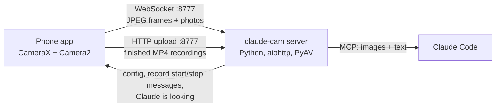
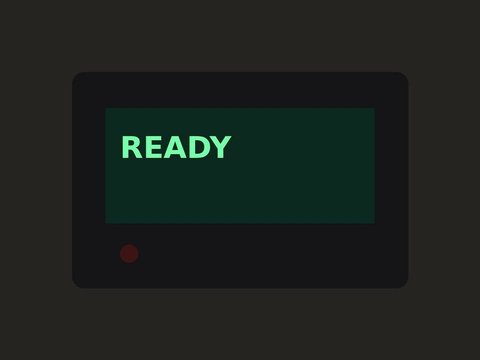
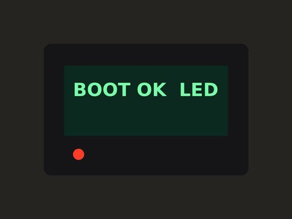
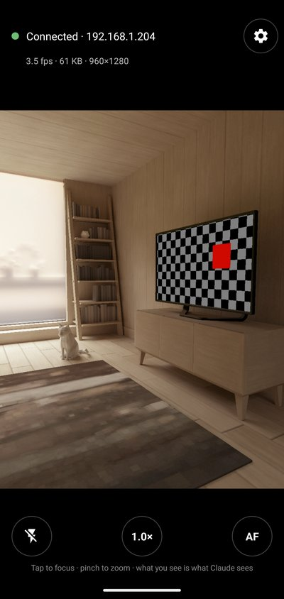
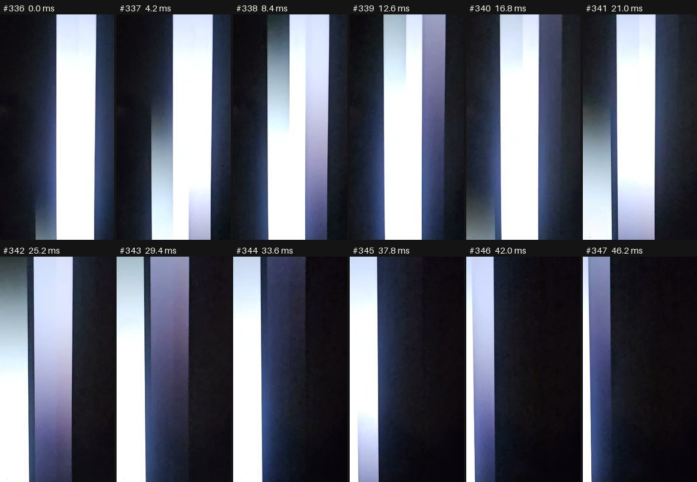

# Giving Claude eyes: how and why Claude Cam was built

Claude Cam lets Claude see through a phone's camera, and since version 1.1, record and analyse video,
including high-speed clips. It's an Android app and a small server, and Claude uses it through MCP
tools. This is the story of why it exists, how it's designed, and what we
learned building it.

## The problem: an agent that can't see its own results

Claude Code is good at working on real systems. It runs commands, reads logs, flashes firmware and
restarts services. But a lot of real work ends somewhere software can't see: an LED that should
blink, a little LCD that should show a value, a TV that should switch input, a printer that should
start moving.

Up to now, the person sitting next to the hardware had to be Claude's eyes:

> **Claude:** I've flashed the new firmware. What does the display show now?
> **You:** It says "WiFi…" and then goes blank.
> **Claude:** Is the blue LED on?

That loop is slow, it loses detail, and it makes you narrate every step instead of building
something. Claude can't notice the thing you didn't think to mention, and it can't see something
that flickers past while you're typing.

## The idea

The idea came from [@ssjrocks](https://github.com/ssjrocks), who works with Claude on hardware and
home-lab projects. Everyone already has a good camera in their pocket. If a phone app could stream
to a service Claude can query, Claude could simply say *"open the app and point it at the
display"*. From then on it could watch the device itself while it runs commands.

## Design goals

1. **See results as they happen, not only on request.** Commands often finish before Claude gets to
   look. The tools had to cover "what just happened?" and "tell me when it changes", not just "take a picture".
2. **No fiddling for the person holding the phone.** Open the app and point. No typing addresses
   if possible. No accounts.
3. **Honest framing.** What the person sees on the phone should be exactly what Claude gets. The
   person should always know when Claude is looking.
4. **Safe by default.** A camera on your network that an AI can read deserves care about who else can reach it.

## Architecture

**The phone connects to the computer, not the other way round.** Claude runs on the computer, phones
are bad at hosting servers (sleep, changing IPs, battery), and having the phone dial out means it
doesn't matter what network tricks are between them. The server advertises itself over mDNS
(`_claudecam._tcp`), so the app usually finds it without anyone typing an address.

**One WebSocket carries the live traffic.** The phone sends binary messages: a 4-byte header length, a
small JSON header, then the JPEG. The server sends JSON commands back: stream settings, "take a
photo", record start/stop, torch/zoom/focus, messages to show, and activity pings for the badge.
Recordings are too big for that, so when one finishes, the phone POSTs the MP4 to `/upload/<token>`.
The token is a one-time value the server handed out when it asked for the recording, so nothing else
on the network can drop files into the recordings folder.

**MCP is the interface to Claude.** MCP tool results can contain images, so a tool call hands Claude
the actual picture with a text caption ("Photo 3060x4080 taken 16:33:17.0"). The server speaks MCP in
two ways:
- **stdio:** Claude Code starts `claude-cam stdio` itself. This is how the plugin works. No
  background service, no setup beyond installing uv. If several Claude Code sessions are open, the
  first one hosts the phone connection and the others relay through it. If the host session closes,
  another takes over within seconds and the phone reconnects to it.
- **Streamable HTTP:** run `claude-cam serve` as an always-on service, and Claude Code connects to
  `http://127.0.0.1:8777/mcp`.

## Designing tools for an agent

The most interesting decisions were about what the tools should be. A camera API for humans would
be "start stream, take photo". An agent needs something different.

**Three kinds of images.** `camera_frames` reads the live stream: instant, about 1440x1080, at 3 fps
(10 fps while Claude is actively watching). `camera_snapshot` takes a real full-resolution photo,
about 12 MP on a modern phone, and can crop it. That way Claude can read a tiny serial number without
pulling 12 MP images all the time. And `camera_record_video` records real video, up to 240 fps, for
anything faster than the stream (see version 1.1 below). Images cost tokens, so the default sizes are
moderate and every tool takes a `max_size`.

**A 90-second memory.** The server keeps the last ~90 seconds of the stream. Claude can ask for "4 frames
from the last 6 seconds" after a command has already run, and see a boot animation it would
otherwise have missed.

**Waiting for a change, with a baseline.** `camera_wait_for_change` blocks until the picture changes,
then waits for it to *settle*, then returns before and after frames:

| Before | After |
| --- | --- |
|  |  |

*Simulated device from the test harness. The tool reported "Change detected 1.33 s after the
baseline… settled 0.67 s later."*

The catch is timing. By the time Claude has run a command and called the tool, the display may have
changed already. So the tool takes `baseline_at`: Claude runs `date +%s.%N && ./flash.sh`, then passes
that timestamp, and the comparison starts from the frame captured just before the command, taken
from the history buffer.

Detection is deliberately simple and cheap. Each frame becomes a 320-pixel, slightly blurred
greyscale thumbnail. A pixel counts as changed if it moves more than 22 grey levels, which ignores
sensor noise and small auto-exposure drift. The picture has changed when enough of the area changed:
0.3%, 1.2% or 5% for high, medium and low sensitivity. A `region` restricts it to one LED or one part
of a screen.

**Coordination with the human.** `camera_message` puts text on the phone and vibrates. With
`wait_for_done_seconds`, the tool blocks until the person taps **Done**. Claude can say "tilt the
phone down a bit, then tap Done" and continue exactly when it's ready, without a chat round-trip.

**Being watched should never be a surprise.** Every time Claude reads the camera, the phone shows a
"Claude is looking" badge, or "Claude is watching" for the length of a wait. The preview uses
`FIT_CENTER`, so the person sees the whole frame Claude gets, with nothing cropped off the edges.

**Small things that matter for real devices.** The app tracks how the phone is held, so frames stay
upright in landscape. Exposure compensation fixes washed-out glowing screens. Tap-to-focus locks
focus so it doesn't hunt on a flat display. Focus requests from Claude come in coordinates of the
upright image, and the app maps them back to the sensor.

## Security model

The server listens on the local network because the phone has to reach it. From the network, only
three things answer: the phone's WebSocket, a landing page, and the APK download. Everything that
returns images or controls the phone (the MCP endpoint, the HTTP API, the live view) only answers
connections from the computer itself. It also rejects browser requests with a foreign `Origin`,
which blocks DNS-rebinding tricks from web pages. There's no pairing step, so anything on your LAN
could pretend to be the phone. That's an accepted trade-off for a home-network tool, and it's
documented in the README.

## How it was built

Claude Cam was built in one long Claude Code session, with Claude writing the code and testing as it
went.

1. **Server first, with a fake phone.** Before any Android code existed, a ~100-line simulated phone
   (`claude_cam/fake_phone.py`) streamed a synthetic "device display" whose text came from a file.
   Changing the file simulated the device reacting to a command. That allowed testing every tool,
   including change detection and `baseline_at`, without hardware.
2. **Proving Claude Code passes the images through.** A headless `claude -p` session was pointed at
   the server and asked what the fake display said. It answered "CODE 7351", which confirmed that
   images in MCP results reach the model.
3. **The app.** Kotlin, CameraX (preview, a frame-analysis stream and full-resolution capture bound
   together), and OkHttp for the WebSocket.
4. **An emulator with a virtual room.** The Android emulator's *virtual scene* camera renders a 3D
   room with a TV in it. The real APK ran against it to test the whole loop: streaming, photos,
   focus and exposure control, a message tapped Done (driven through `uiautomator`), rotation to
   landscape, and automatic reconnects when the server restarts.

   

5. **The real phone.** On a Galaxy S23, the first live check pointed the camera into a PC case.
   Claude cropped a 12 MP photo to the liquid cooler's screen and read *31 °C, pump 2339 rpm, fan
   1500 rpm*. Then it compared that with the PC's own sensor feed, which said 31.3 °C, 2339 and 1500.
   That's the use case in one picture: checking a physical display against what the software claims.
6. **Packaging for everyone.** The first version was a Linux systemd service. To make it usable by
   anyone, the server became a Python package that `uvx` can run anywhere. It gained the stdio
   mode with host/relay/takeover, and it shipped as a Claude Code plugin with a skill, so the camera
   tools and the knowledge of when to use them install together.

## Lessons learned

**Test against something that moves.** The emulator's virtual TV has an animated pattern. That exposed
a real bug: after detecting a change, the "has it settled?" check used the same threshold as "has it
changed?". Gradual changes (fades, exposure ramps, animations) move very little from one frame to the
next, so they looked settled while still changing. Settling now uses a quarter of the threshold, and
the result reports how different the final frame is from the baseline.

**The device is in a person's hand.** During the real-phone test, the phone disconnected right after
Claude changed a setting. Claude started investigating a crash. In fact the user had pressed the home
button by accident, and pointed out that Claude should have asked first. That's now part of the
server's instructions to Claude and of the skill: if the phone disconnects, moves or goes dark, ask
the person what happened before assuming a bug.

**Ask the hardware what it actually does.** The server asked for 1280-pixel frames, and the S23
quietly chose 960x720, the closest size it offered below that. Asking for 1920 got 1440x1080, so
that's now the default.

**Isolate your tests from real users, even when the user is you.** A later emulator test was expected
to be invisible to the home network. But the emulator *could* see the mDNS advertisement, connected to
the real server, and bumped the real phone off. That incident uncovered a genuine bug: discovery
could override an address the user had typed in while that address was still connecting. Now
discovery only takes over after the saved address has kept failing for about 20 seconds.

## Version 1.1: seeing things too fast for the eye

**Why.** Claude was helping debug GIF playback on a small LCD and misdiagnosed the problem: it
decided the GIF had black frames. The live stream is only a few frames per second, each exposure
can blend two screen updates, and a 20-30 fps animation falls between the samples. Claude saw "black
or missing frames" that weren't there, and nothing told it that its sampling was too coarse.

**Recording.** `camera_record_video` records MP4s on the phone and uploads them to the computer:
- **High-speed clips (120/240 fps)**, for anything fast.
- **Start/stop recordings at 30/60 fps**, for demos and how-to videos.

`camera_video_frames` then examines a recording frame by frame.

**The phone's real limits, and how we got past them.** On a Galaxy S23, CameraX reported 30 fps at
most and no high-speed mode. A per-camera probe that also dumps the raw Camera2 characteristics showed
something different: the main camera advertises *constrained high-speed video* at 120 and 240 fps. It
just lacks the encoder profiles CameraX looks for. So the app now records high-speed clips directly with
Camera2 and MediaRecorder when CameraX can't, and the S23 delivers real 240 fps at 1080p. As a further
fallback, Claude can ask the user to film with the phone's own camera app (Samsung's Slow motion) and
share the video to Claude Cam, which uploads it for the same analysis. So far that path has been tested
by sharing from the emulator's Files app; real Samsung slow-motion files are still to be tried.

*Twelve consecutive frames from the S23 at 240 fps, 4.2 ms apart: a white line crossing a TV that's
playing a 60 fps test video.*

**Measure every frame; don't eyeball samples.** The analysis decodes the clip with PyAV and records
each frame's brightness and how much it changed from the previous frame. From that it reports:
- dark-frame runs, with frame numbers;
- the real rate at which the picture updates;
- frames the phone dropped.

Two details turned out to matter:
- **Find the active area.** A small screen inside a big frame dilutes every whole-frame number below
  its threshold. The analysis tracks where in the frame changes happen and reports that area
  separately. On a synthetic test, whole-frame numbers said "8 updates/s, no dark frames", while the
  screen alone showed the true 24 updates/s and every injected blank.
- **Warn about undersampling.** When the picture changes in nearly every captured frame, the content
  is at least as fast as the recording. The tool now says so in capitals, instead of quietly reporting
  "30 updates/s" for a 60 fps video. That warning is what would have prevented the original
  misdiagnosis.

### Lessons from building it

Most of the mistakes while testing 1.1 were in how the data was handled, not in the hardware. Each
one is now a rule in the `phone-camera` skill.

- **A contact sheet is a sample.** A 240 fps clip of a line crossing a screen and leaving it was
  summarised with 16 evenly spaced frames out of 643. Most showed an empty black screen, and Claude
  started theorising about the TV's backlight. The user had watched it and knew it was simply the
  line being out of view. The skill now says to examine every frame of the relevant range (`step=1`,
  cropped, with the per-frame table) before concluding anything. It also says to find out what the
  content should look like first, not to invent hardware explanations, and to believe the user when
  they say it looks fine. The tool output says the same: "16 of 643 frames… only a sample".
- **Coordinate time-limited things with the person.** A one-minute test video was being recorded
  without anyone checking it was playing. Claude now puts "Start the video, then tap Done" on the
  phone, and records the moment Done is tapped.
- **Keep frame numbers honest when exporting.** By default `ffmpeg` duplicates frames to fill timing
  gaps, which shifts the numbering. `-fps_mode passthrough` keeps file `frame_0342.jpg` equal to frame #342.
- **Version skew between sessions.** Several Claude Code sessions share one phone connection through
  whichever session started first. After an update, a new session relaying through an old one now
  explains that the other sessions need a restart, instead of failing with "unknown tool".

## Limitations and ideas

- Android only for now; an iOS app would need a different build toolchain.
- One phone at a time.
- The app has to be open on screen. A background mode with a notification ("Claude wants to see
  something") would let Claude ask for the camera when it needs it.
- No pairing. A one-time code shown on the phone would close the "anything on the LAN" gap.
- High-speed recording depends on what the phone exposes to apps. Phones without CameraX or Camera2
  high-speed modes top out around 30 fps; their own camera app's Slow motion is the fallback.
- No preview during a Camera2 high-speed clip (the session only allows the recorder's surface here).
- Ideas: on-device OCR or QR decoding, multiple cameras (several phones as fixed viewpoints), smarter
  contact sheets that favour frames where something happens, and audio for demo recordings.

Contributions and ideas are welcome. Open an issue or a pull request.
